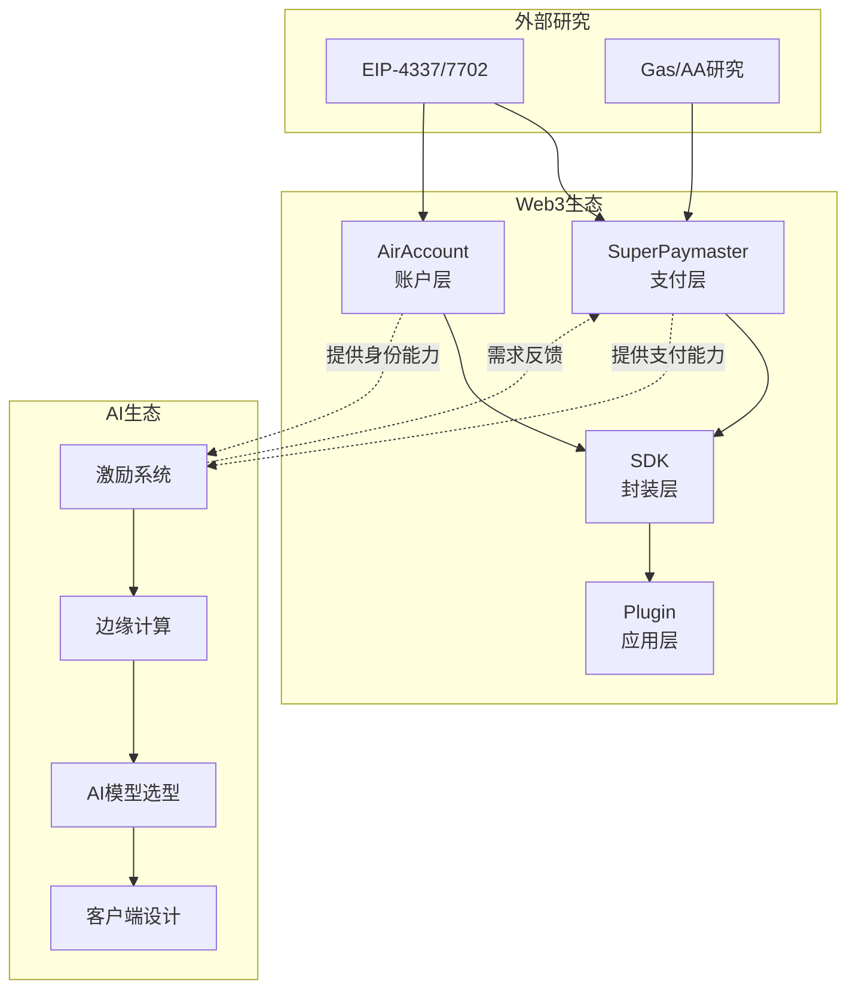

> From: https://claude.ai/chat/46977f03-438f-48ea-bb97-0fe7aa5d6367

# you asked

给你描述一个情况，你给我提供一个简单的而有系统的级的解决方案(包括技术和结构、流程等等的，都可以）。这个方案不一定是技术架构，可能是组合。那当前呢我有多个github项目。那每一个都是用clo code来去开发。持续的分析，然后退出新的版本。那现在有一个情况就是这些仓库他们之间是有呃关系的。比如说super pay master和 air account是呃一个是支付啊，一个是账户。那SDK呢又是基于他们两个之上做的这个note gS的呃一个封装，而我们的插件呢又基于SDK来去开发的。而这四个仓库呢，他们又都要基于探访的EIP发展啊，包括account，包括gas啊，包括一些。技术的发展呃的研究报告来指导啊和这个接入更多的能力。换句话说，所有的库呢又基于一些外部的研究和外部的仓库来去做整体的上下文和背景，包括去校正他们的方向和提升他们的能力，对接也好，引入研究也好，那这只是啊我一个一个产品体系，一个生态。那实际上如果要达成我个人的长期的远景的话，这个生态还不够，可能还有另外一个生态。如果这个生态是一个组织的话，那还有另外一个生态，另外一个生态可能是跟AI相关的。比如AI模型的选型训练，客户端的这种设计，啊，比如说这种AI底层背后的这种边缘计算的架构的设计，他们相互之间的这种激励。关系而这个激励关系呢有需要基于刚才我提到的这个payma aircount这些基于它来去提供激励的机制。换句话说，这两个生态之间又是相互依存相互依存的关系。那我每天面对这个情况都要不停的切换上下文，切换上下文的成本非常高。不论对于个人还是对于这个 AIClaude Code来说，那有没有一种解决方案啊，能够呃解决我这个问题啊，切节省我切换上下文的成本，快速的在整个的大的布局啊这个全体的背景下去让所有的repoitory独立的Claude Code都能够有这个上下文。然后呢也能够持续的在一个road map中持续推进。但每一个可repository占据自己的呃这种sub-road map。

---

# claude response

# 多仓库多生态协同架构方案

我来为你设计一个**分层上下文管理系统**，核心思路是：**让上下文像代码一样可继承、可组合、可版本化**。

---

## 一、问题诊断

```
┌─────────────────────────────────────────────────────────────────┐
│                      你当前的痛点                                │
├─────────────────────────────────────────────────────────────────┤
│  1. 每次切换仓库 = 重新建立上下文 (高成本)                        │
│  2. Claude Code 每个session独立，无法共享全局视野                 │
│  3. 跨仓库依赖关系只存在你脑中，未被系统化                         │
│  4. 两个生态的关联逻辑未被显式文档化                              │
│  5. Roadmap分散，难以追踪全局进度                                │
└─────────────────────────────────────────────────────────────────┘
```

---

## 二、解决方案：分层上下文架构

### 2.1 整体架构图

```
┌─────────────────────────────────────────────────────────────────────────┐
│                           L0: 战略层 (Strategic)                         │
│  ┌────────────────────────────────────────────────────────────────────┐ │
│  │  📁 universe/  (元仓库 - 所有Claude Code都能访问)                   │ │
│  │  ├── VISION.md          # 个人长期愿景                              │ │
│  │  ├── MASTER_ROADMAP.md  # 总体路线图                                │ │
│  │  ├── ECOSYSTEM_MAP.md   # 两个生态的关系图                          │ │
│  │  └── GLOSSARY.md        # 术语表，确保一致性                        │ │
│  └────────────────────────────────────────────────────────────────────┘ │
├─────────────────────────────────────────────────────────────────────────┤
│                           L1: 生态层 (Ecosystem)                         │
│  ┌─────────────────────────────┐    ┌─────────────────────────────────┐ │
│  │ 📁 eco-web3/               │    │ 📁 eco-ai/                      │ │
│  │ ├── ECOSYSTEM.md           │◄──►│ ├── ECOSYSTEM.md                │ │
│  │ ├── DEPENDENCIES.md        │    │ ├── DEPENDENCIES.md             │ │
│  │ ├── ROADMAP.md             │    │ ├── ROADMAP.md                  │ │
│  │ └── research/              │    │ └── research/                   │ │
│  │     ├── EIP-4337.md        │    │     ├── edge-computing.md       │ │
│  │     └── gas-optimization.md│    │     └── incentive-models.md     │ │
│  └─────────────────────────────┘    └─────────────────────────────────┘ │
├─────────────────────────────────────────────────────────────────────────┤
│                           L2: 仓库层 (Repository)                        │
│  ┌────────────┐ ┌────────────┐ ┌────────────┐ ┌────────────┐            │
│  │superpaymaster│ │air-account │ │    sdk     │ │  plugin    │ ...       │
│  │  CLAUDE.md  │ │  CLAUDE.md │ │  CLAUDE.md │ │  CLAUDE.md │            │
│  │  (继承上层) │ │  (继承上层) │ │  (继承上层) │ │  (继承上层) │            │
│  └──────┬─────┘ └──────┬─────┘ └──────┬─────┘ └──────┬─────┘            │
│         │              │              │              │                   │
│         └──────────────┴───────┬──────┴──────────────┘                   │
│                                ▼                                         │
│  ┌────────────────────────────────────────────────────────────────────┐ │
│  │                    共享 context 注入机制                            │ │
│  │          (通过 CLAUDE.md 引用或 git submodule)                      │ │
│  └────────────────────────────────────────────────────────────────────┘ │
└─────────────────────────────────────────────────────────────────────────┘
```

---

### 2.2 核心组件设计

#### 组件 1: 元仓库 `universe/`

这是你**所有项目的"大脑"**，存放共享上下文：

```
universe/
├── README.md                    # 快速导航
├── VISION.md                    # 5年愿景
├── MASTER_ROADMAP.md            # 总路线图 (看板式)
├── ECOSYSTEM_MAP.md             # 生态关系图 (Mermaid)
│
├── ecosystems/
│   ├── web3/
│   │   ├── OVERVIEW.md          # Web3生态概述
│   │   ├── DEPENDENCY_GRAPH.md  # 依赖关系
│   │   ├── ROADMAP.md           # 季度目标
│   │   └── research/            # EIP、技术研究
│   │
│   └── ai/
│       ├── OVERVIEW.md
│       ├── ROADMAP.md
│       └── research/
│
├── shared/
│   ├── GLOSSARY.md              # 术语定义
│   ├── CODING_STANDARDS.md      # 编码规范
│   └── DECISION_LOG.md          # 技术决策记录(ADR)
│
└── templates/
    ├── CLAUDE.md.template       # 仓库级CLAUDE.md模板
    └── WEEKLY_SYNC.md           # 周同步模板
```

#### 组件 2: 每个仓库的 `CLAUDE.md` (可继承)

```markdown
# CLAUDE.md for superpaymaster

## 🌍 全局上下文 (自动注入)
<!-- 以下内容从 universe/ 继承，Claude Code启动时读取 -->

**当前角色**: 你正在开发 SuperPaymaster，这是 Web3 生态的支付层。

**生态位置**: 
- 属于: Web3生态 (eco-web3)
- 上游依赖: EIP-4337, EIP-7702 研究
- 下游被依赖: SDK, Plugin
- 关联生态: AI生态需要本模块提供激励结算能力

**关键文档** (需要时查阅):
- 愿景: ../universe/VISION.md
- 生态关系: ../universe/ECOSYSTEM_MAP.md
- 本生态Roadmap: ../universe/ecosystems/web3/ROADMAP.md

## 🎯 本仓库上下文

**核心职责**: Gas抽象支付、Paymaster合约、跨链支付路由

**当前里程碑**: v0.3.0 - 多签集成
**进度**: 60% | 阻塞: 等待 air-account v0.2.0 的签名接口

**架构约束**:
- 必须兼容 EIP-4337 EntryPoint v0.7
- Gas估算误差 < 5%
- 支持的链: Ethereum, Arbitrum, Base

**与其他仓库的接口**:
```
superpaymaster ──exports──> IPaymaster interface
                             │
air-account ────────────────imports
                             │
sdk ─────────────────────────imports (via air-account)
```

## 📋 当前任务队列
<!-- 从GitHub Issues同步或手动更新 -->
1. [ ] 实现多签验证逻辑 (P0)
2. [ ] 优化gas估算准确性 (P1)
3. [ ] 添加Base链支持 (P2)
```

---

### 2.3 工作流程设计

#### 日常工作流

```
┌─────────────────────────────────────────────────────────────────┐
│                     每日启动仪式 (5分钟)                          │
├─────────────────────────────────────────────────────────────────┤
│  1. 打开 universe/MASTER_ROADMAP.md 看全局进度                   │
│  2. 确定今天要推进的仓库(s)                                      │
│  3. cd 到目标仓库，Claude Code 自动读取 CLAUDE.md               │
│     → 上下文已自动建立，无需手动解释                              │
└─────────────────────────────────────────────────────────────────┘
                                │
                                ▼
┌─────────────────────────────────────────────────────────────────┐
│                       开发阶段                                   │
├─────────────────────────────────────────────────────────────────┤
│  • Claude Code 已知道当前仓库的角色和依赖                         │
│  • 需要跨仓库信息时，提示: "参考 universe/ecosystems/web3/..."   │
│  • 产出的决策记录到 DECISION_LOG.md                              │
└─────────────────────────────────────────────────────────────────┘
                                │
                                ▼
┌─────────────────────────────────────────────────────────────────┐
│                     结束同步 (5分钟)                              │
├─────────────────────────────────────────────────────────────────┤
│  1. 更新本仓库 CLAUDE.md 中的进度                                │
│  2. 如有跨仓库影响，更新 universe/ 中相关文档                     │
│  3. 提交变更                                                    │
└─────────────────────────────────────────────────────────────────┘
```

#### 周同步仪式

```markdown
# 周同步 (30分钟)

## 1. 全局审视
- [ ] 检查 MASTER_ROADMAP.md 各里程碑状态
- [ ] 更新生态间依赖的阻塞点

## 2. 各仓库状态
| 仓库 | 本周进展 | 下周目标 | 阻塞 |
|------|---------|---------|------|
| superpaymaster | ... | ... | ... |
| air-account | ... | ... | ... |

## 3. 研究同步
- [ ] 新的EIP进展是否需要纳入
- [ ] AI生态是否有新技术可引入

## 4. 文档维护
- [ ] 过时信息清理
- [ ] 新增术语到 GLOSSARY.md
```

---

### 2.4 技术实现选项

#### 选项 A: Git Submodule (推荐起步)

```bash
# 每个仓库添加 universe 作为 submodule
cd superpaymaster
git submodule add git@github.com:user/universe.git .universe

# CLAUDE.md 引用
# 参考上下文: .universe/ecosystems/web3/OVERVIEW.md
```

**优点**: 简单，版本可控
**缺点**: 需要手动 `git submodule update`

#### 选项 B: 符号链接 + 本地同步

```bash
# 本地维护一个 universe 目录
# 每个仓库建立符号链接
ln -s ~/universe ~/projects/superpaymaster/.context
```

#### 选项 C: 自定义 MCP Server (进阶)

如果你需要更强的自动化，可以创建一个 MCP server：

```
┌─────────────────────────────────────────────────────────────────┐
│                    Universe MCP Server                          │
├─────────────────────────────────────────────────────────────────┤
│  提供的 Tools:                                                  │
│  • get_global_context() → 返回愿景+当前仓库位置                  │
│  • get_dependency_status(repo) → 返回上下游状态                 │
│  • update_roadmap(repo, status) → 更新进度                     │
│  • get_research_brief(topic) → 获取相关研究摘要                 │
└─────────────────────────────────────────────────────────────────┘
```

---

## 三、生态关系文档示例

### `ECOSYSTEM_MAP.md`

```markdown
# 生态关系图

## 视觉总览



## 依赖矩阵

| 被依赖 ↓ / 依赖 → | PM | AA | SDK | Plugin | AI-Incentive |
|------------------|----|----|-----|--------|--------------|
| SuperPaymaster   | -  | ✓  | -   | -      | -            |
| AirAccount       | -  | -  | -   | -      | -            |
| SDK              | ✓  | ✓  | -   | -      | -            |
| Plugin           | -  | -  | ✓   | -      | -            |
| AI-Incentive     | ✓  | ✓  | -   | -      | -            |

## 变更影响传播

当 SuperPaymaster 发布新版本时:
1. SDK 需要更新依赖
2. Plugin 需要测试兼容性
3. AI-Incentive 需要验证支付接口

当 EIP 有重大更新时:
1. PM 和 AA 同时需要评估影响
2. 更新 universe/ecosystems/web3/research/
3. 在周同步中讨论架构调整
```

---

## 四、实施路线图

```
Phase 1 (本周)                    Phase 2 (2周内)                   Phase 3 (1个月)
──────────────────────────────    ──────────────────────────────    ──────────────────
                                                                    
┌─────────────────┐              ┌─────────────────┐              ┌─────────────────┐
│ 创建 universe/  │              │ 完善各仓库      │              │ 流程固化        │
│ 基础结构        │ ──────────►  │ CLAUDE.md       │ ──────────►  │ (可选)MCP开发   │
│                 │              │                 │              │                 │
│ • VISION.md     │              │ • 依赖关系文档化│              │ • 自动化同步    │
│ • ECOSYSTEM_MAP │              │ • 任务队列同步  │              │ • 进度Dashboard │
│ • 基础模板      │              │ • submodule配置 │              │ • 周报自动生成  │
└─────────────────┘              └─────────────────┘              └─────────────────┘

预期效果:                         预期效果:                         预期效果:
切换上下文从20分钟→5分钟          每个repo启动即有全局视野           全自动化运作
```

---

## 五、快速启动脚本

要不要我帮你生成 `universe/` 的初始结构？包括：
1. 基础目录结构和模板文件
2. 针对你提到的 4 个仓库的 CLAUDE.md 模板
3. 生态关系图初稿
4. 工作流 checklist

这样你今天就能开始使用这套系统。

---

# you asked

刚才的描述就只是举例子，它可能会存在，比如说多个组织之间的协作，这多个组织呢可能有各自的呃这种使命愿景和vision。啊，但是呢他们有相互之间有协作和依赖。啊，不仅仅你我举例的这两个组织之间。对那这种情况你建议的架构可以么？另外我看你没有推荐RAG等等的知识库技术栈，原因是？

---

# claude response

你问得很好，这两个问题都触及了方案的核心假设。让我重新审视：

## 一、关于多组织协作架构

我之前的方案是**中心化单主体**架构，确实不适合多组织场景。多组织需要**联邦式架构**：

```
┌─────────────────────────────────────────────────────────────────────────────┐
│                         联邦式多组织架构                                     │
├─────────────────────────────────────────────────────────────────────────────┤
│                                                                             │
│   ┌─────────────┐      ┌─────────────┐      ┌─────────────┐                │
│   │  Org A      │      │  Org B      │      │  Org C      │                │
│   │  (Web3生态) │      │  (AI生态)   │      │  (硬件生态) │                │
│   │             │      │             │      │             │                │
│   │ ┌─────────┐ │      │ ┌─────────┐ │      │ ┌─────────┐ │                │
│   │ │私有上下文│ │      │ │私有上下文│ │      │ │私有上下文│ │                │
│   │ │• 内部战略│ │      │ │• 模型参数│ │      │ │• 硬件设计│ │                │
│   │ │• 财务信息│ │      │ │• 训练数据│ │      │ │• 供应链  │ │                │
│   │ └─────────┘ │      │ └─────────┘ │      │ └─────────┘ │                │
│   │      │      │      │      │      │      │      │      │                │
│   │ ┌─────────┐ │      │ ┌─────────┐ │      │ ┌─────────┐ │                │
│   │ │公开接口 │◄├──────┼─►公开接口 │◄├──────┼─►公开接口 │ │                │
│   │ │• API规范│ │      │ │• API规范│ │      │ │• API规范│ │                │
│   │ │• 路线图 │ │      │ │• 路线图 │ │      │ │• 路线图 │ │                │
│   │ │• 依赖声明│ │      │ │• 依赖声明│ │      │ │• 依赖声明│ │                │
│   │ └─────────┘ │      │ └─────────┘ │      │ └─────────┘ │                │
│   └─────────────┘      └─────────────┘      └─────────────┘                │
│          │                    │                    │                        │
│          └────────────────────┼────────────────────┘                        │
│                               ▼                                             │
│                    ┌─────────────────────┐                                  │
│                    │   协议层 (Protocol)  │                                  │
│                    │                     │                                  │
│                    │ • 接口契约定义       │                                  │
│                    │ • 版本兼容性规则     │                                  │
│                    │ • 变更通知机制       │                                  │
│                    │ • 联合路线图(可选)   │                                  │
│                    └─────────────────────┘                                  │
│                                                                             │
└─────────────────────────────────────────────────────────────────────────────┘
```

**关键区别**：

| 维度 | 单主体架构 | 联邦式架构 |
|------|-----------|-----------|
| 信息边界 | 全部可见 | 分层可见性 |
| 控制权 | 集中 | 各组织自治 |
| 同步方式 | 直接读取 | 通过协议层 |
| 适用场景 | 个人/单团队 | 多独立组织 |

---

## 二、关于为什么没推荐 RAG

这是我有意为之的选择，原因如下：

### 2.1 问题本质的判断

```
你描述的核心痛点:
┌──────────────────────────────────────────────────────┐
│  "切换上下文成本高"                                   │
│  "让所有 Claude Code 都能有这个上下文"                │
│  "在一个 roadmap 中持续推进"                          │
└──────────────────────────────────────────────────────┘
                         │
                         ▼
              这是 ❌结构问题 而非 ❌检索问题

你缺的不是"从海量文档中找到相关内容"
你缺的是"系统化地组织和传递上下文"
```

### 2.2 RAG vs 结构化文档 对比

| 场景 | RAG | 结构化Markdown |
|------|-----|---------------|
| "superpaymaster 依赖谁？" | 语义搜索，可能返回噪音 | 直接读 `DEPENDENCIES.md`，精确 |
| "当前 SDK 的阻塞点是什么？" | 需要更新embedding | 直接读 `CLAUDE.md` 任务队列 |
| "EIP-4337 最新进展对我们的影响？" | ✅ RAG更适合 | 需要手动维护摘要 |
| 启动Claude Code时注入上下文 | 需要额外pipeline | 直接读文件即可 |

### 2.3 我的渐进式策略

```
Phase 1: 结构化文档 (你现在需要的)
────────────────────────────────────
• 解决80%问题
• 零额外基础设施
• Claude Code原生支持
• 今天就能用

         │
         ▼

Phase 2: 轻量级搜索 (可选)
────────────────────────────────────
• 当研究文档 > 50篇
• 用 ripgrep / fzf 做全文搜索
• 或 GitHub Code Search
• 仍然零运维成本

         │
         ▼

Phase 3: RAG (当真正需要时)
────────────────────────────────────
• 当历史文档 > 数百篇
• 需要语义问答 ("我们之前讨论过X吗？")
• 需要跨大量论文做综述
• 此时值得付出运维成本
```

### 2.4 RAG 的隐藏成本

```
如果现在就上 RAG:
┌────────────────────────────────────────────────────┐
│  需要维护:                                          │
│  • 向量数据库 (Pinecone/Milvus/本地Chroma)          │
│  • Embedding 模型选择和更新                         │
│  • 文档切分策略 (chunk size, overlap)               │
│  • 检索质量调优 (top-k, reranking)                  │
│  • 文档更新时的重新索引                              │
│  • 与 Claude Code 的集成 pipeline                   │
├────────────────────────────────────────────────────┤
│  实际收益:                                          │
│  • 对于你描述的场景... 可能不大                      │
│  • 因为你需要的是"精确上下文"而非"语义搜索"          │
└────────────────────────────────────────────────────┘
```

---

## 三、修正后的完整方案

综合多组织 + 技术选型考量：

```
┌─────────────────────────────────────────────────────────────────────────────┐
│                           完整架构                                          │
├─────────────────────────────────────────────────────────────────────────────┤
│                                                                             │
│  Layer 0: 个人战略层 (仅你可见)                                              │
│  ┌────────────────────────────────────────────────────────────────────────┐ │
│  │  my-universe/                                                          │ │
│  │  ├── VISION.md            # 你的个人终极愿景                            │ │
│  │  ├── ORG_PORTFOLIO.md     # 你参与的所有组织及角色                       │ │
│  │  └── PRIVATE_STRATEGY.md  # 组织间的私有布局考量                         │ │
│  └────────────────────────────────────────────────────────────────────────┘ │
│                                                                             │
│  Layer 1: 组织层 (各组织独立管理)                                            │
│  ┌──────────────────┐  ┌──────────────────┐  ┌──────────────────┐          │
│  │  org-web3/       │  │  org-ai/         │  │  org-xxx/        │          │
│  │  ├── MISSION.md  │  │  ├── MISSION.md  │  │  ├── MISSION.md  │          │
│  │  ├── ROADMAP.md  │  │  ├── ROADMAP.md  │  │  ├── ROADMAP.md  │          │
│  │  ├── repos/      │  │  ├── repos/      │  │  ├── repos/      │          │
│  │  │   ├── pm/     │  │  │   ├── model/  │  │  │   └── ...     │          │
│  │  │   ├── aa/     │  │  │   ├── edge/   │  │  │               │          │
│  │  │   └── sdk/    │  │  │   └── client/ │  │  │               │          │
│  │  └── INTERFACES.md│  └── INTERFACES.md │  └── INTERFACES.md  │          │
│  │    (对外公开接口) │    (对外公开接口)   │    (对外公开接口)    │          │
│  └──────────────────┘  └──────────────────┘  └──────────────────┘          │
│           │                     │                     │                     │
│           └─────────────────────┼─────────────────────┘                     │
│                                 ▼                                           │
│  Layer 2: 协议层 (组织间契约)                                                │
│  ┌────────────────────────────────────────────────────────────────────────┐ │
│  │  federation-protocol/                                                  │ │
│  │  ├── DEPENDENCY_MATRIX.md    # 谁依赖谁                                │ │
│  │  ├── INTERFACE_CONTRACTS/    # API/接口规范                            │ │
│  │  ├── CHANGE_LOG.md           # 跨组织变更通知                           │ │
│  │  └── JOINT_ROADMAP.md        # 联合里程碑 (可选)                        │ │
│  └────────────────────────────────────────────────────────────────────────┘ │
│                                                                             │
│  Layer 3: 知识层 (按需启用)                                                  │
│  ┌────────────────────────────────────────────────────────────────────────┐ │
│  │  现阶段: 结构化文档 + 全文搜索 (ripgrep)                                 │ │
│  │  未来可选: RAG (当研究文档 > 100篇时考虑)                                │ │
│  └────────────────────────────────────────────────────────────────────────┘ │
│                                                                             │
└─────────────────────────────────────────────────────────────────────────────┘
```

---

## 四、实用建议

### 什么时候该引入 RAG？

当你发现自己频繁说出这些话时：

```
✅ 引入 RAG 的信号:
• "那篇关于 gas 优化的论文在哪来着？"
• "我们三个月前讨论过这个问题，结论是什么？"
• "有哪些 EIP 和我们的方向相关？" (需要跨几十篇文档)
• "总结一下我们所有关于 TEE 的研究"

❌ 不需要 RAG 的信号:
• "SDK 当前版本是什么？" → 读 package.json
• "superpaymaster 依赖谁？" → 读 DEPENDENCIES.md
• "下一个里程碑是什么？" → 读 ROADMAP.md
```

---

**总结**：我的建议是先用结构化文档解决当前问题，这个方案**今天就能用**且**零运维成本**。RAG 是好工具，但应该在真正需要时再引入，避免过早优化。

你觉得这个思路对你的场景是否适用？如果你的研究文档量已经很大，我可以补充 RAG 集成的具体方案。