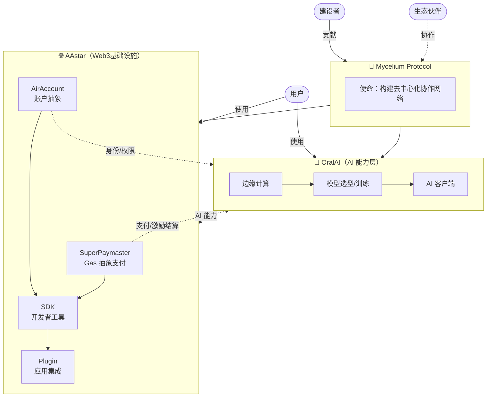

# BroodBrain 架构方案：菌丝协议组织大脑

> 基于 Claude web 版分析 + 组织协议视角补充

---

## 一、重新定义问题

原始问题是"个人开发者切换多仓库上下文成本高"。现在视角升级为：

```
原问题:  个人 → 多仓库 → 上下文丢失
新视角:  协议 → 多组织 → 多仓库 → 上下文继承 + 公开透明
```

**Mycelium Protocol（菌丝协议）的本质**：

不是一个产品，是一个**活的网络**。每个加入的组织既是建设者也是生态参与者。组织的大脑（BroodBrain）是网络的神经系统——让所有参与者共享上下文、对齐方向、降低协作摩擦。

---

## 二、三层架构

```
┌─────────────────────────────────────────────────────────────────────┐
│                    L0: 协议层（Mycelium Protocol）                   │
│                                                                     │
│  公开透明，所有成员可见                                               │
│  • 协议使命 / 愿景 / 价值观                                           │
│  • 生态全景图（各组织角色与关系）                                      │
│  • 协议级路线图（联合里程碑）                                          │
│  • 接口契约（组织间 API / 协作规范）                                   │
│  • 如何加入（建设者 / 用户 / 生态参与者）                              │
└───────────────────────────┬─────────────────────────────────────────┘
                            │ 继承
            ┌───────────────┼───────────────┐
            ▼               ▼               ▼
┌───────────────┐  ┌───────────────┐  ┌───────────────┐
│  L1: 组织层   │  │  L1: 组织层   │  │  L1: 组织层   │
│               │  │               │  │               │
│   AAstar      │  │   OralAI      │  │   未来组织...  │
│               │  │               │  │               │
│ • 我们是谁    │  │ • 我们是谁    │  │ • 我们是谁    │
│ • 使命/愿景   │  │ • 使命/愿景   │  │ • 使命/愿景   │
│ • 提供什么    │  │ • 提供什么    │  │ • 提供什么    │
│ • 需要什么    │  │ • 需要什么    │  │ • 需要什么    │
│ • 公开路线图  │  │ • 公开路线图  │  │ • 公开路线图  │
│ • 任务看板    │  │ • 任务看板    │  │ • 任务看板    │
└───────┬───────┘  └───────┬───────┘  └───────┬───────┘
        │ 关联              │ 关联              │ 关联
        ▼                  ▼                  ▼
┌─────────────────────────────────────────────────────────────────────┐
│                    L2: 仓库层（GitHub Repos）                        │
│                                                                     │
│  SuperPaymaster  AirAccount  SDK  Plugin  AI-Model  Edge  ...       │
│                                                                     │
│  每个 repo 的 CLAUDE.md 继承上层上下文                                │
│  每个 repo 的任务关联到 L1 组织任务看板                               │
└─────────────────────────────────────────────────────────────────────┘
```

---

## 三、组织成员看到什么

加入任意一个组织的成员，打开 BroodBrain 后能看到：

```
┌─────────────────────────────────────────────────────────────┐
│  协议全景                                                    │
│  ├── 菌丝协议是什么 / 为什么存在                              │
│  ├── 当前有哪些组织，各自做什么                               │
│  └── 组织间如何协作 / 依赖关系                                │
│                                                             │
│  本组织上下文                                                │
│  ├── 使命愿景                                                │
│  ├── 我们提供什么（产品 / 服务 / 能力）                        │
│  ├── 我们需要什么（资源 / 协作 / 反馈）                        │
│  ├── 路线图 + 当前进展（加权真实进度）                         │
│  └── 每个任务 → 关联的 GitHub repo / PR / 具体进展            │
│                                                             │
│  AI 开发上下文（CLAUDE.md 继承链）                            │
│  ├── 任何仓库的 Claude Code 自动继承协议上下文                 │
│  ├── 无需重复解释背景                                         │
│  └── 跨仓库切换成本从 20 分钟 → 2 分钟                        │
└─────────────────────────────────────────────────────────────┘
```

---

## 四、外部参与者看到什么

非成员访问 BroodBrain 公开站点（如 mushroom.cv）：

```
协议层：
  • 菌丝协议是什么，要做什么
  • 有哪些组织在参与
  • 如何加入（建设者 / 用户 / 合作伙伴）

各组织公开名片：
  • 这个组织为何存在
  • 提供什么能力或产品
  • 需要什么（招募 / 资金 / 合作 / 用户）
  • 公开路线图和进展（可选详细程度）
```

**外部参与者两种角色**：
- **建设者**：clone 这个 repo，在自己组织目录下贡献上下文，提 PR 加入协议
- **用户/生态参与者**：使用组织的产品/服务，作为消费端参与网络

---

## 五、技术实现：BroodBrain 扩展路径

### 现有基础（保持不变）

```
BroodBrain 当前能力：
✅ backlog CLI 管理任务（markdown + YAML frontmatter）
✅ 静态导出 → Cloudflare Pages / GitHub Pages
✅ 任务关联 GitHub repo（references 字段）
✅ /sync-progress 扫描 repo 进度，更新任务
✅ 加权真实进度计算（非机械 done/total）
✅ CLAUDE.md 提供 AI 开发上下文
```

### 扩展：多组织目录结构

```
Brood/（当前 = AAstar 的 backlog）
├── protocol/                    # 新增：协议层
│   ├── MISSION.md               # 菌丝协议使命愿景
│   ├── ECOSYSTEM_MAP.md         # 组织全景图（Mermaid）
│   ├── HOW_TO_JOIN.md           # 如何加入协议
│   └── INTERFACE_CONTRACTS.md   # 组织间协作规范
│
├── orgs/                        # 新增：各组织上下文
│   ├── aastar/
│   │   ├── PROFILE.md           # 组织名片（公开）
│   │   ├── MISSION.md
│   │   └── INTERFACES.md        # 对外提供的接口/能力
│   ├── oralai/
│   │   ├── PROFILE.md
│   │   └── ...
│   └── template/                # 新组织加入模板
│       └── PROFILE.template.md
│
├── backlog/                     # 现有：AAstar 任务（或迁移为 orgs/aastar/backlog/）
│   ├── tasks/
│   ├── docs/
│   └── decisions/
│
├── CLAUDE.md                    # 现有：AI 上下文（扩展为继承协议层）
└── scripts/
    └── export-backlog.js        # 现有：静态导出（扩展为多组织导出）
```

### CLAUDE.md 继承链

```markdown
# CLAUDE.md（根级，任意 repo clone 此 repo 后可引用）

## 协议上下文
参阅: protocol/MISSION.md → 理解菌丝协议
参阅: protocol/ECOSYSTEM_MAP.md → 理解各组织关系

## 当前组织上下文（AAstar）
参阅: orgs/aastar/PROFILE.md → 我们是谁、做什么
参阅: orgs/aastar/INTERFACES.md → 我们提供/依赖什么

## 任务上下文
当前路线图见 backlog/ 目录
每个任务的 references 字段关联对应 GitHub repo
运行 /sync-progress 获取最新进展
```

---

## 六、生态关系图（初版）



---

## 七、实施路线图

### Phase 1：协议层建设（本周）

```
目标：让任何人打开 BroodBrain 就能理解菌丝协议和 AAstar

交付物：
□ protocol/MISSION.md — 协议使命愿景（中英文）
□ protocol/ECOSYSTEM_MAP.md — 生态关系图
□ protocol/HOW_TO_JOIN.md — 参与方式
□ orgs/aastar/PROFILE.md — AAstar 组织名片
□ 更新根 CLAUDE.md，引用以上文档
□ 更新 dist/ 导出，确保这些文档在静态站可见
```

### Phase 2：多组织支持（2周内）

```
目标：OralAI 等组织可以 clone + 贡献自己的上下文

交付物：
□ orgs/template/ — 新组织加入模板
□ 定义 PROFILE.md 格式规范（统一但灵活）
□ 协议 PR 流程文档（如何提交加入申请）
□ 导出脚本支持 protocol/ 和 orgs/ 目录
```

### Phase 3：跨组织任务关联（1个月）

```
目标：任务能显式关联到跨组织依赖

交付物：
□ backlog task 支持 org: 字段（标注归属组织）
□ /sync-progress 扩展为跨组织扫描
□ 依赖矩阵（谁 block 谁）可视化
□ 联合路线图视图
```

### Phase 4：协议自治（未来）

```
目标：协议运作不依赖单一维护者

交付物：
□ 组织自助加入流程（PR + review）
□ 贡献者角色和权限模型
□ 可选 RAG（当研究文档 > 100 篇时）
□ 自动化周报 / 跨组织同步通知
```

---

## 八、与 Claude web 版方案的差异

| 维度 | Claude web 版建议 | 当前方案调整 |
|------|-----------------|------------|
| 主体 | 个人开发者 | 组织 + 协议（多主体） |
| 仓库 | universe/ 元仓库 | BroodBrain 本身即元仓库 |
| 层级 | L0 个人→L1 生态→L2 仓库 | L0 协议→L1 组织→L2 仓库 |
| 透明度 | 分层可见（部分私有） | 组织内公开透明 |
| 加入方式 | 未定义 | 建设者 / 用户 / 生态伙伴 |
| 工具 | 建议 git submodule / MCP | BroodBrain 静态导出（已有） |
| RAG | Phase 3 可选 | 同，保持渐进 |

**核心差异**：Claude web 版把 BroodBrain 当作"一个工具"，而实际上 BroodBrain **就是协议神经系统的实体**——它不只是记录上下文，它本身就是组织透明运作的方式。

---

## 九、非技术原则

1. **菌丝网络不是层级制** — 各组织平等，协议层是共识不是管控
2. **透明是默认值** — 组织内部对成员全透明，外部可见路线图和进展
3. **上下文是资产** — 写下来的上下文会被 AI 继承，好的文档=好的协作
4. **渐进加入** — 新组织可以先只提交 PROFILE.md，逐步深入参与
5. **协议优先于工具** — 工具（BroodBrain）服务于协议，而不是相反

---

## 十、渐进式上下文交付（Progressive Context Delivery）

### 核心原则

不把所有上下文一次性倒出去——而是**按需交付**：任务需要什么，AI 就看到什么。

### 设计方案

```
任务上下文匹配流程：

TASK-42（labels: superpaymaster, gas-abstraction; milestone: m-1）
  ↓
BroodBrain 上下文解析
  ↓
┌─────────────────────────────────────────────┐
│  L0 上下文（始终注入）                        │
│  • 协议使命（protocol/MISSION.md 摘要）        │
│  • 你的角色（AAstar 在生态中的位置）            │
├─────────────────────────────────────────────┤
│  L1 上下文（任务所属组织）                     │
│  • AAstar 当前阶段目标                        │
│  • 本里程碑（m-1）进展概要                     │
│  • 任务依赖（block/blocked-by 关联任务摘要）    │
├─────────────────────────────────────────────┤
│  L2 上下文（任务关联仓库）                     │
│  • SuperPaymaster repo 最近 10 条 commit      │
│  • 相关 CHANGELOG 片段                        │
│  • 关联 PR/issue 摘要                         │
└─────────────────────────────────────────────┘
  ↓
生成任务专属 CLAUDE.md 片段（拷贝到 clipboard 或写入 /tmp/task-context.md）
```

### 实现方式

```bash
# 新 skill：/task-context TASK-42
# 输出：该任务的最小化上下文包，直接可 paste 给 Claude Code

输出格式：
---
## 当前任务上下文

**任务**: TASK-42 - SuperPaymaster 集成测试
**里程碑**: Phase 1 - 基础设施
**状态**: In Progress（预估 60%）

**协议背景**: AAstar 是 Mycelium Protocol 的 Web3 基础设施层，
             SuperPaymaster 负责 Gas 抽象支付，是 SDK 的核心依赖。

**本里程碑上下文**:
- 当前 m-1 整体进度：43%（加权）
- block 本任务的：TASK-38（AirAccount 接口 - Done）
- 本任务 block：TASK-45（SDK 集成）

**仓库快照** (github.com/aastar-inc/SuperPaymaster):
- 最近变更：feat: add bundler relay endpoint (2d ago)
- CHANGELOG: v0.3.0 - 新增 multichain 支持
---
```

### 钻取机制（Drill-down）

用户在对话中说 "更多关于 AirAccount 依赖" → `/task-context TASK-42 --expand dependencies`

分层钻取：
- `--expand protocol` → 完整协议文档
- `--expand milestone` → 里程碑下所有任务
- `--expand repo` → 完整 git log + CHANGELOG
- `--expand cross-org` → OralAI 等相关组织上下文

---

## 十一、全仓库同步（All-Repos Sync）

### 目标

不只追踪有 `references:` 字段的任务——而是**主动扫描本地所有仓库**，提取能力、接口、最近变更，构建全局能力注册表。

### 本地仓库清单

```
/Users/jason/Dev/
├── aastar/          # AAstar 核心业务
├── aastar-sdk/      # SDK 层
├── mycelium/        # Mycelium Protocol
├── AI/              # AI 能力层（推测为 OralAI 相关）
├── AuraAI/          # AI 产品层
├── Community/       # 社区/文档
├── Demos/           # 演示项目
├── Brood/           # BroodBrain（本仓库）
└── ...（其余仓库）
```

### 全仓库同步架构

```
scripts/sync-all-repos.js

流程：
1. 扫描 /Users/jason/Dev/ 下所有 git 仓库
2. 对每个仓库提取：
   ├── package.json / Cargo.toml → 项目名、依赖、对外接口
   ├── README.md 首段 → 项目用途摘要
   ├── CHANGELOG.md 最新 section → 最近变更
   ├── git log --since="7 days ago" → 近期 commit 摘要
   └── 导出的 API 类型文件（.d.ts / abi.json） → 接口契约
3. 聚合写入 protocol/REPO_REGISTRY.md（协议层全局视图，按组织分区）
4. 更新 protocol/ECOSYSTEM_MAP.md 中的接口契约部分
5. 触发 build → 静态站更新
```

### REPO_REGISTRY.md 格式

```markdown
# AAstar 仓库能力注册表
_最后同步: 2026-03-24_

## SuperPaymaster
- **位置**: /Users/jason/Dev/aastar/SuperPaymaster
- **用途**: ERC-4337 Paymaster，Gas 费用抽象
- **当前版本**: v0.3.0
- **对外接口**: `validatePaymasterUserOp`, `postOp`, `deposit`
- **最近变更** (7天): feat: multichain relay, fix: nonce overflow
- **依赖**: AirAccount (账户验证), bundler-api

## AirAccount
- **位置**: /Users/jason/Dev/aastar/AirAccount
- **用途**: ERC-4337 Account Abstraction
- **当前版本**: v0.2.1
- ...

## aastar-sdk
- **位置**: /Users/jason/Dev/aastar-sdk
- **用途**: 开发者集成 SDK，封装 SuperPaymaster + AirAccount
- ...
```

### 定时同步

```bash
# 每日自动触发（可通过 launchd 或手动运行）
node scripts/sync-all-repos.js

# 也可集成到 update-task.sh 之前：
# sync → build → commit → push
```

---

## 十二、未来兼容性设计（Future Compatibility）

### 设计原则：插拔式架构

```
上下文系统 = 摄入层 + 存储层 + 交付层

每层可独立升级，不影响其他层。
```

### 三层可替换设计

```
┌─────────────────────────────────────────────────────┐
│  摄入层（Ingestion）                                  │
│                                                     │
│  当前: 本地 git + markdown 文件扫描                   │
│  Phase 2: GitHub API（跨机器、CI 触发）               │
│  Phase 3: Webhook（push 事件实时更新）                │
│  Phase 4: 组织自助提交（PR → 自动集成）               │
└──────────────────────┬──────────────────────────────┘
                       │
┌──────────────────────▼──────────────────────────────┐
│  存储层（Context Store）                              │
│                                                     │
│  当前: markdown 文件 + JSON（dist/api/）              │
│  Phase 2: 结构化 YAML schema（可验证、可查询）         │
│  Phase 3: 向量索引（当文档 > 100 篇时，可选 RAG）      │
│  Phase 4: 分布式（各组织自托管，协议层聚合）            │
└──────────────────────┬──────────────────────────────┘
                       │
┌──────────────────────▼──────────────────────────────┐
│  交付层（Delivery）                                   │
│                                                     │
│  当前: CLAUDE.md 静态文件（手动 paste）               │
│  Phase 2: /task-context skill（自动生成上下文包）      │
│  Phase 3: MCP Server（Claude Code 直接查询）          │
│  Phase 4: RAG API（任意 AI 工具订阅上下文流）          │
└─────────────────────────────────────────────────────┘
```

### 统一 Schema（现在就定义，未来不破坏）

每个组织的 `PROFILE.md` 遵循固定 frontmatter，未来工具可自动解析：

```yaml
---
schema_version: "1.0"
org_id: aastar
org_name: AAstar
layer: infrastructure          # infrastructure | ai | application | protocol
status: active                 # active | stealth | archived
protocols:
  - mycelium
provides:
  - capability: gas-abstraction
    interface: ERC-4337 Paymaster
    repo: github.com/aastar-inc/SuperPaymaster
  - capability: account-abstraction
    interface: ERC-4337 Account
    repo: github.com/aastar-inc/AirAccount
depends_on:
  - org: oralai
    capability: ai-inference
    optional: true
contact:
  builder: jason
  github: github.com/AAStarCommunity
---
```

### 兼容性保证

| 升级路径 | 向后兼容 | 说明 |
|---------|---------|------|
| 添加新字段到 PROFILE.md | ✅ | 旧工具忽略未知字段 |
| 迁移 markdown → 向量索引 | ✅ | markdown 始终保留，向量是附加层 |
| 添加 MCP server | ✅ | CLAUDE.md 方式同时保留 |
| 新组织加入 | ✅ | 只需提交 PROFILE.md，其余渐进补充 |
| 跨组织依赖新增 | ✅ | `depends_on` 是可选字段 |

---

## 十三、下一步行动

```bash
# 当前分支：context
# 接下来可以执行：

1. 在此分支完成 protocol/ 和 orgs/aastar/ 目录结构
2. 写 MISSION.md、PROFILE.md（含 schema v1.0 frontmatter）、ECOSYSTEM_MAP.md 初稿
3. 写 scripts/sync-all-repos.js（全仓库扫描）
4. 更新 CLAUDE.md 引用新结构
5. build → 验证静态导出包含新文档
6. merge 到 main → 部署到 mushroom.cv
```
